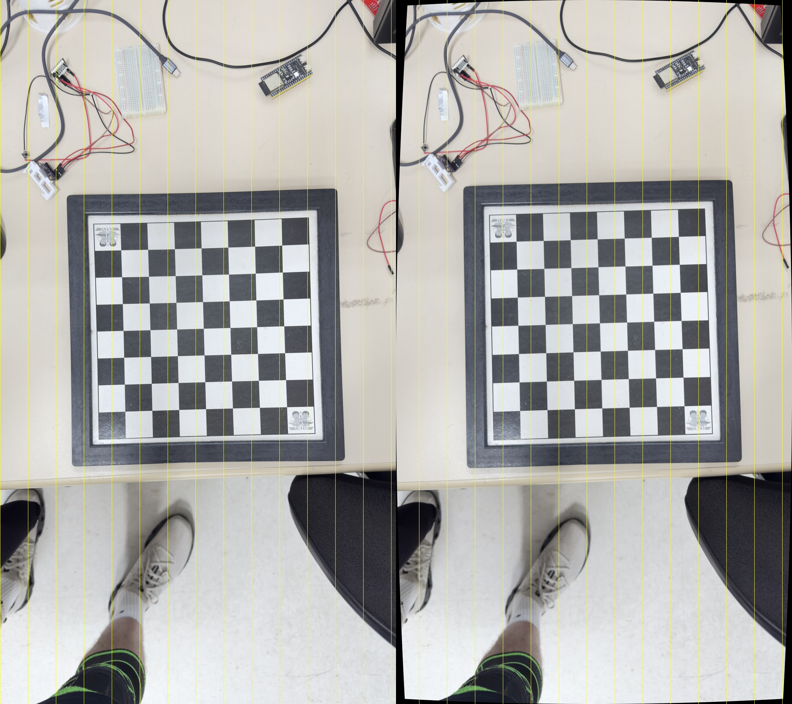
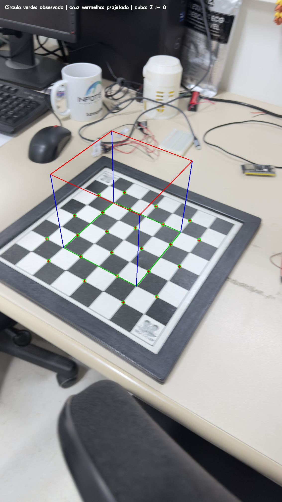

# Calibração de câmera e projeção de pontos 3D

**Dupla:** Gustavo Jakobi (GRR20221253) e Bruno Crestani (GRR20221240)
**Disciplina:** Visão Computacional — UFPR, 2026
**Git:** https://github.com/BrunoCrestani/syncingCamera

## Método

Calibramos a câmera principal (1×) de um iPhone 16 Pro (lente de 6,765 mm, f/1.78, equivalente a 24 mm) pelo método de Zhang [1], com o OpenCV [2]. O tabuleiro do VRI tem 8 × 8 quadrados, ou seja, 7 × 7 cantos internos. Não medimos o lado do quadrado; por isso, as coordenadas 3D estão em **unidades de quadrado**. Isso não altera K nem a distorção.

As 19 fotos (4536 × 8064, retrato) foram reduzidas para 1134 × 2016, com o mesmo fator e sem recorte. Quatro fotos foram reservadas para validação antes da calibração. O detector encontrou o tabuleiro em 14 fotos: 10 de calibração e 4 de validação. As outras 5 têm o tabuleiro cortado pela borda da foto ou reflexos fortes.

O modelo de projeção é `s [u, v, 1]ᵀ = K [R | t] [X, Y, Z, 1]ᵀ`, com distorção radial e tangencial aplicada às coordenadas normalizadas. O mundo fica no tabuleiro: origem no primeiro canto, Z = 0 no plano do tabuleiro.

1. `findChessboardCorners` e `cornerSubPix` localizam os cantos. Uma homografia confere cada detecção e rejeita cantos presos em reflexos.
2. `calibrateCamera` estima K e a distorção. Usamos o modelo `radial1` (k1, p1, p2; k2 = k3 = 0).
3. `getOptimalNewCameraMatrix` (α = 1) e `undistort` removem a distorção.
4. Nas fotos de validação, `solvePnP` estima R e t com metade dos cantos (padrão xadrez). `projectPoints` projeta a outra metade, que comparamos com os cantos detectados. Também projetamos um cubo com Z ≠ 0.

## Resultados

RMS de reprojeção da calibração: **0,60 px**.

```text
K = [ 1451,95     0      571,29 ]      (k1, k2, p1, p2, k3) =
    [    0     1453,02   976,75 ]      (0,136; 0; -0,0098; 0,0006; 0)
    [    0        0         1   ]
```

`fx ≈ fy` indica pixels quadrados, e o centro óptico fica perto do centro da imagem (567, 1008). Pela focal do EXIF, esperávamos fx ≈ 1400 px; a diferença de 4 % é compatível com o valor nominal de 24 mm. O modelo completo reduz o RMS só para 0,56 px, mas dá k3 = −3,33: um sinal de sobreajuste, porque o tabuleiro nunca chega às bordas da imagem.

O iPhone já corrige a maior parte da distorção por software, então a correção é pequena. Para medi-la, ajustamos uma reta a cada linha e coluna de cantos e calculamos a distância RMS dos cantos à reta. A perspectiva preserva retas; a curvatura restante vem da lente e do ruído do detector.

| Foto de validação | Retitude original (px) | Retitude corrigida (px) |
| --- | --- | --- |
| IMG_8157 | 0,32 | 0,11 |
| IMG_8165 | 0,64 | 0,62 |
| IMG_8171 | 0,30 | 0,24 |
| IMG_8174 | 0,69 | 0,57 |



**Figura 1.** IMG_8157 original e corrigida. As linhas amarelas verticais servem de referência.

### Projeção de pontos 3D

| Foto | Pontos de teste | Erro médio (px) | RMS (px) | Erro máximo (px) |
| --- | --- | --- | --- | --- |
| IMG_8157 | 24 | 0,20 | 0,22 | 0,42 |
| IMG_8165 | 24 | 1,01 | 1,25 | 3,65 |
| IMG_8171 | 24 | 0,54 | 0,59 | 0,93 |
| IMG_8174 | 24 | 0,90 | 0,97 | 1,65 |

RMS de validação em todos os 96 pontos: **0,85 px**. Exemplos (tabela completa em `resultados/projecoes.csv`):

| Foto | X, Y, Z (quadrados) | u, v previstos (px) | u, v observados (px) | Erro (px) |
| --- | --- | --- | --- | --- |
| IMG_8171 | 1, 0, 0 | 634,3; 630,9 | 634,5; 630,2 | 0,68 |
| IMG_8171 | 3, 2, 0 | 690,3; 850,5 | 690,1; 850,2 | 0,33 |
| IMG_8171 | 5, 4, 0 | 741,2; 1046,6 | 740,5; 1046,3 | 0,74 |
| IMG_8174 | 1, 0, 0 | 500,0; 773,1 | 500,5; 772,8 | 0,59 |
| IMG_8174 | 3, 2, 0 | 543,7; 914,7 | 544,0; 915,9 | 1,23 |
| IMG_8174 | 5, 4, 0 | 597,5; 1088,5 | 597,8; 1089,0 | 0,66 |

O cubo tem base de (1, 1, 0) a (5, 5, 0) e altura de 4 quadrados, do lado da câmera. Por exemplo, em IMG_8171 o vértice (1, 1, −4) é projetado em (603,1; 767,5). Os vértices de cima não têm referência medida, então a conferência do cubo é visual: as arestas verticais convergem para o ponto de fuga esperado e o topo fica maior que a base nas vistas inclinadas.



**Figura 2.** IMG_8174: cantos observados (círculo verde), projetados (cruz vermelha) e cubo projetado.

## Discussão

Os pontos projetados ficam, em média, a menos de 1 px dos cantos detectados em fotos que não entraram na calibração. O maior erro é em IMG_8165, que tem reflexos fortes sobre o tabuleiro. A correção da distorção reduziu a curvatura das linhas em todas as fotos de validação, mas pouco, porque o iPhone já entrega a foto quase sem distorção.

Limitações: poucas vistas de calibração muito inclinadas (2 de 10 passam de 30°; 4 ficam abaixo de 10°), o tabuleiro nunca perto das bordas da imagem e o lado do quadrado sem medida. Os erros estão em pixels e não medem a precisão 3D em milímetros.

## Referências

1. Zhang, Z. *A Flexible New Technique for Camera Calibration.* IEEE TPAMI, 22(11), 1330–1334, 2000.
2. OpenCV. *Camera Calibration.* https://docs.opencv.org/4.x/dc/dbb/tutorial_py_calibration.html
3. Todt, E. *Camera Model and Calibration.* Slides da disciplina, UFPR, 2026.
